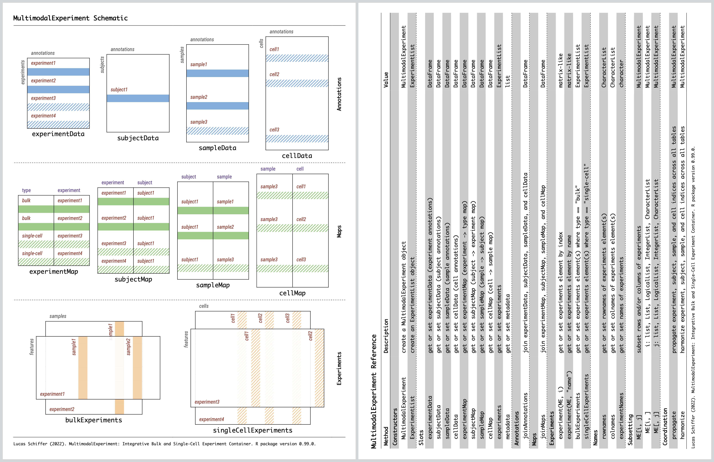

<!-- README.md is generated from README.Rmd. Please edit that file -->

# MultimodalExperiment

<!-- badges: start -->

[](https://www.codefactor.io/repository/github/schifferl/MultimodalExperiment)
<!-- badges: end -->

MultimodalExperiment is an S4 class that integrates bulk and single-cell
experiment data; it is optimally storage-efficient, and its methods are
exceptionally fast. It effortlessly represents multimodal data of any
nature and features normalized experiment, subject, sample, and cell
annotations, which are related to underlying biological experiments
through maps. Its coordination methods are opt-in and employ
database-like join operations internally to deliver fast and flexible
management of multimodal data.

## Installation

To install
*[MultimodalExperiment](https://bioconductor.org/packages/3.17/MultimodalExperiment)*
from Bioconductor, use
*[BiocManager](https://CRAN.R-project.org/package=BiocManager)* as
follows.

``` r
BiocManager::install("MultimodalExperiment")
```

To install
*[MultimodalExperiment](https://bioconductor.org/packages/3.17/MultimodalExperiment)*
from GitHub, use
*[BiocManager](https://CRAN.R-project.org/package=BiocManager)* as
follows.

``` r
BiocManager::install("schifferl/MultimodalExperiment", dependencies = TRUE, build_vignettes = TRUE)
```

Most users should simply install
*[MultimodalExperiment](https://bioconductor.org/packages/3.17/MultimodalExperiment)*
from Bioconductor.

## Cheat Sheet

[](MultimodalExperiment.pdf)

## Usage

``` r
library(MultimodalExperiment)

ME <-
    MultimodalExperiment()

bulkExperiments(ME) <-
    ExperimentList(
        pbRNAseq = pbRNAseq
    )

singleCellExperiments(ME) <-
    ExperimentList(
        scADTseq = scADTseq,
        scRNAseq = scRNAseq
    )

subjectMap(ME)[["subject"]] <-
    "SUBJECT-1"

sampleMap(ME)[["subject"]] <-
    "SUBJECT-1"

cellMap(ME)[["sample"]] <-
    "SAMPLE-1"

ME <-
    propagate(ME)

experimentData(ME)[["published"]] <-
    c(NA_character_, "2018-11-19", "2018-11-19") |>
    as.Date()

subjectData(ME)[["condition"]] <-
    as.character("healthy")

sampleData(ME)[["sampleType"]] <-
    as.character("peripheral blood mononuclear cells")

cellType <- function(x) {
    if (x[["CD4"]] > 0L) {
        return("T Cell")
    }

    if (x[["CD14"]] > 0L) {
        return("Monocyte")
    }

    if (x[["CD19"]] > 0L) {
        return("B Cell")
    }

    if (x[["CD56"]] > 0L) {
        return("NK Cell")
    }

    NA_character_
}

cellData(ME)[["cellType"]] <-
    experiment(ME, "scADTseq") |>
    apply(2L, cellType)

ME

## MultimodalExperiment with 1 bulk and 2 single-cell experiment(s).
## 
## experimentData: DataFrame with 3 row(s) and 1 column(s).
##           published
##              <Date>
## pbRNAseq         NA
## scADTseq 2018-11-19
## scRNAseq 2018-11-19
## 
## subjectData: DataFrame with 1 row(s) and 1 column(s).
##             condition
##           <character>
## SUBJECT-1     healthy
## 
## sampleData: DataFrame with 1 row(s) and 1 column(s).
##                                  sampleType
##                                 <character>
## SAMPLE-1 peripheral blood mononuclear cells
## 
## cellData: DataFrame with 5000 row(s) and 1 column(s).
##                     cellType
##                  <character>
## AAACCTGAGAGCAATT      B Cell
## AAACCTGAGGCTCTTA     NK Cell
## ...                      ...
## TTTGTCATCATGGTCA     NK Cell
## TTTGTCATCTCGTTTA     NK Cell
## 
## bulkExperiments: ExperimentList with 1 bulk experiment(s).
## [1] pbRNAseq: matrix with 3000 row(s) and 1 column(s).
## 
## singleCellExperiments: ExperimentList with 2 single-cell experiment(s).
## [1] scADTseq: matrix with 8 row(s) and 5000 column(s).
## [2] scRNAseq: matrix with 3000 row(s) and 5000 column(s).
## 
## Need help? Try browseVignettes("MultimodalExperiment").
## Publishing? Cite with citation("MultimodalExperiment").
```

## Contributing

Please note that
*[MultimodalExperiment](https://github.com/schifferl/MultimodalExperiment)*
is released with a [code of conduct](CODE_OF_CONDUCT.md). By
[contributing](CONTRIBUTING.md), you agree to abide by its terms.
